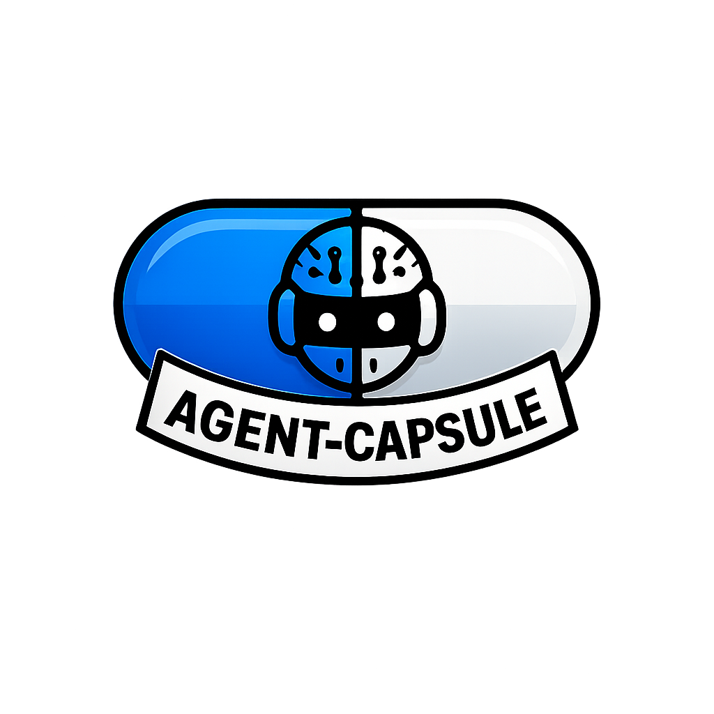

<p align="center">
  
</p>

# agent-capsule

[](https://github.com/OWNER/agent-capsule/actions/workflows/lint.yml)

Run [Claude Code](https://docs.anthropic.com/en/docs/claude-code) inside a rootless
[Podman](https://podman.io/) container that shares a single project directory with the host.

One shell script, one Dockerfile. The container gets the project at `/workspace`, an
isolated home at `/home/dev`, a Node and Go toolchain, and hard resource limits;
everything else on the host stays out of reach.

## What you get

- Rootless containment: container root maps to your host UID, so files written in
  `/workspace` are owned by you. All capabilities dropped, no-new-privileges,
  memory/CPU/pids limits.
- One login for all sessions: authenticate once with `--auth-login`; the OAuth
  credentials file is live-shared into every session, token refreshes included.
- Isolated sessions: each project or named session gets its own `/home/dev`, so
  parallel agents do not trample each other's transcripts or settings.
- Shared knowledge: a global `CLAUDE.md` is mounted into every session, and Claude's
  per-project memory is pooled across sessions working on the same repo.
- Batteries in the image: Go toolchain, golangci-lint. Extra tools (SuperClaude slash
  commands, hunkdiff) are opt-in with `--with`, each selection getting its own image tag.

## Requirements

- Linux with rootless Podman configured, **or** macOS with Podman (see below)
- `make` for `make install` (or copy the two files manually)

### macOS

Podman on macOS runs containers inside a Linux VM, so every host path
agent-capsule bind-mounts has to actually be visible inside that VM. A plain
init covers the common case, since `podman machine init` already mounts
`$HOME:$HOME` by default, which is where agent-capsule keeps everything
(project checkouts, `~/.agent-capsule/`, credentials):

```sh
podman machine init
podman machine start
```

If `agent-capsule` was installed via Nix (nix-darwin, `nix profile install`,
`nix build`, etc.), also mount `/nix/store` — the closures of any Nix-built
tools ever get bind-mounted into the container (e.g. `--mount`-ing a wrapper's
extra tools, or a `--with` extra resolving under `/nix/store`) need to be
visible to the VM. Passing any `--volume` at all replaces Podman's implicit
default instead of adding to it, so `$HOME:$HOME` must be listed explicitly
too — `--volume` also can't be added to an already-created machine, so get
both in from the start:

```sh
podman machine init --volume $HOME:$HOME --volume /nix/store:/nix/store:ro
podman machine start
```

Leaving out `$HOME:$HOME` breaks the build, since agent-capsule bind-mounts
`PROJECT_DIR` itself (plus `~/.agent-capsule/` and the auth home) under
`$HOME`: `Error: statfs /Users/.../your-project: no such file or directory`.

## Install

```sh
make install                    # -> ~/.local/bin/agent-capsule
                                #    ~/.local/share/agent-capsule/Dockerfile
make install PREFIX=/usr/local  # alternative destination
```

The container image builds automatically on first run and rebuilds whenever the
Dockerfile or the base image tags change.

## Quick start

```sh
agent-capsule --auth-login          # once: log in, credentials are shared afterwards
agent-capsule ~/code/myapp          # run Claude Code in a capsule on a project
agent-capsule --shell .             # a shell inside the capsule instead of claude
agent-capsule --session fix-auth ~/code/myapp   # named session for parallel agents
agent-capsule --with superclaude,hunkdiff .     # opt in to the extra tools
agent-capsule . -- -p "explain this repo"       # args after -- go to claude
```

## Flags at a glance

| Flag                                             | Effect                                                                             |
|--------------------------------------------------|------------------------------------------------------------------------------------|
| `--build`                                        | force a rebuild of the container image                                             |
| `--shell`                                        | start bash instead of claude                                                       |
| `--keep-id`                                      | run as your UID inside too (needed for `--dangerously-skip-permissions`)           |
| `--offline`                                      | no network inside the container                                                    |
| `--session NAME`                                 | named per-session home, for parallel agents on one repo                            |
| `--with TOOL[,TOOL]`                             | opt in to extra image tools (`superclaude`, `hunkdiff`); `--with list` prints them |
| `--mount SRC[:DEST][:ro]`                        | extra bind mounts (repeatable)                                                     |
| `-d`, `--documentation`                          | mount the Obsidian docs vault read-write at `/vault`                               |
| `--shared-memory-ro`, `--no-shared-memory`       | restrict or disable pooled per-project memory                                      |
| `--shared-claude-md-rw`, `--no-shared-claude-md` | writable or disabled global CLAUDE.md                                              |
| `--version`                                      | print the version and exit                                                         |

## State layout

Everything lives under `~/.agent-capsule/`:

```
auth-home/               shared login (created by --auth-login)
homes/<session>/         one isolated /home/dev per session
project-memory/<hash>/   per-project memory pooled across sessions
CLAUDE.md                global instructions mounted into every session
build/                   image build context and per-variant build hashes
```

## Full reference

`agent-capsule --help` prints the complete documentation (all flags, examples,
SELinux notes); the script header is the single source of truth. Every default
can be overridden with an `AGENT_CAPSULE_*` environment variable (image name,
base tags, resource limits, paths, volume options).

## License

MIT, see [LICENSE](LICENSE).

## Contributors

| Name                                               | Contribution  |
|----------------------------------------------------|---------------|
| [@linouxis9](https://github.com/linouxis9)         | Initial draft |
| [@alcelafranque](https://github.com/alcelafranque) | Reviews       |
